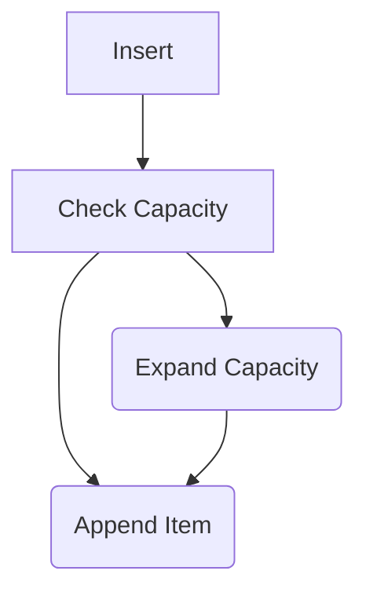
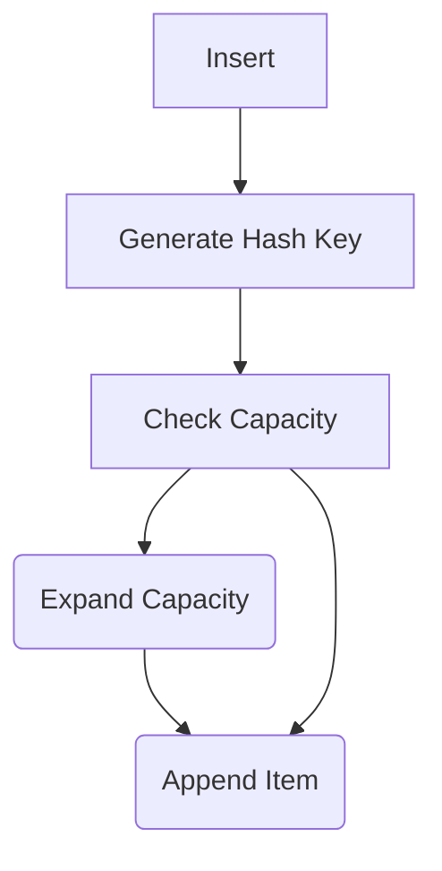

# Hash maps (Dictionaries)

> This is live-coded. The GitHub version of this section is [here]

Vectors are great, but they order data exactly as is it was inserted. Using `find` requires that Rust read each record in turn, and check to see if its the record you were looking for. That's *really, really* fast---often faster than other techniques thanks to read-ahead cache in modern CPUs---but it can be difficult for quickly searching large data sets. Vectors also allow duplicate entries.

If you've used `Dictionary` types in other languages, this is the same thing.

First of all, `HashMap` isn't a type included in the default namespace. You have to use it. At the top of `lib.rs` in `authentication`, add:

```rust
use std::collections::HashMap;
```

For convenience later, let's decorate the `User` structure with `Clone` and `Debug`:

```rust
#[derive(Clone, Debug)]
pub struct User {
    pub username: String,
    pub password: String,
    pub action: LoginAction,
}
```

This will let us copy users when needed. It'll be helpful in a moment.

And let's replace the `get_users()` function with one that creates a `HashMap`---keyed on username:

```rust
pub fn get_users() -> HashMap<String, User> {
    let mut result = HashMap::new();
    result.insert("herbert".to_string(), User::new("herbert", "password", LoginAction::Accept(Role::Admin)));
    result
    /*vec![
        User::new("herbert", "password", LoginAction::Accept(Role::Admin)),
        User::new("bob", "password", LoginAction::Accept(Role::User)),
        User::new("fred", "password", LoginAction::Denied(DeniedReason::PasswordExpired)),
    ]*/
}
```

There's no convenient "insert" macro for `HashMap` ([you'll learn how to make one on day 4!](/day4/hour1/macros.md)). You can manually write an `insert` statement for each entry---it works, but it's cumbersome. Note that we're making a `HashMap`, inserting into it, and then returning. This won't cause any copying, because Rust is *move by default*---you are moving the result out of the function. In most cases, the resulting `memcpy` commands are removed by the compiler for you.

There has to be a better way to transform our vector of users into a `HashMap`, right? We can do it with the `iterator`/`collect` approach. `HashMap` expects to receive data as *tuples* - that is, a collection of variables grouped together. In Rust, a *tuple* looks like this:

```rust
let my_tuple = (a, b);
a.0 = 3;
a.1 = 4;
```

> Tuples are a really handy way to pass data around and return more than one thing from a function. Just be careful, it's easy to get tuple crazy and make your code really hard to read---if you're using a large tuple a lot, it's better to create a named structure with field names. You'll thank me when you come back to debug your code in six months!

Let's walk through transforming our data, in the Rust iterator way:

Comment out the the `let mut result` and returning `result` for now. Uncomment the `vec!` and add a variable declaration:

```rust
let users = vec![
    User::new("herbert", "password", LoginAction::Accept(Role::Admin)),
    User::new("bob", "password", LoginAction::Accept(Role::User)),
    User::new("fred", "password", LoginAction::Denied(DeniedReason::PasswordExpired)),
];
```

That gives us a vector consisting of `[user], [user], [user]` in turn. We want to have a *tuple* of: `[(username, user), (username, user), (username, user)]`. The conventional approach is to use `map`, which transforms iterator entries into other forms. Let's give it a go:

```rust
let tuples = users
    .iter() // Create an iterator
    .map(|user| (user.username, user) ) // Map to a tuple ( username, user )
    .collect(); // Collect infers the collection type from the function return
tuples // Return our created HashMap
```

> `map` is half of the "map-reduce" pattern found in so many other languages. Map transforms an incoming data stream into something else. In this case, we take a `User` in, and emit a tuple containins the username and the `user` on the way out.

Unfortunately, that doesn't compile. The error is that you can't construct a `HashMap<String, User>` from `(String, &User)`. The iterator has helpfully *borrowed* each `User` - storing a pointer to the user, rather than the user itself. That's great for fast iteration (and saving memory), but not what we want here. So lets `clone` the user:

```rust
let tuples = users
    .iter() // Create an iterator
    .map(|user| (user.username.clone(), user.clone()) )
    .collect();
tuples
```

That compiles, and works. We can make it a bit more "Rustacean" by returning the collection directly:

```rust
users
    .iter() // Create an iterator
    .map(|user| (user.username.clone(), user.clone()) )
    .collect()
```

If you want to save memory, you can further optimize this---at the expense of a little more typing---with a function called `drain`:

```rust
users
    .drain(0..)
    .map(|user| ( user.username.clone(), user ))
    .collect()
```

`drain` is a `Vec` function that accepts a *range*. `0..` means "everything". You could use `[1..4]` for records `1, 2, 3` (it's exclusive by default; it you wanted `1,2,3,4` you'd have to use `1..=4`). Drain *removes* each entry from the vector, and passes the removed records to an iterator. You still have to clone `username` (because the key must be its own string), but you no longer need to waste memory and time cloning `user`.

## Accessing HashMap Data

Now let's take a look at the `login` function. The function signature takes a *slice*:

```rust
pub fn login(users: &[User], username: &str, password: &str) -> Option<LoginAction>
```

The slice (`&[User]`) assumes contiguous storage. `HashMap` doesn't offer that guarantee, and converting it to a slice (by accessing the internal values directly) loses many of the benefits of a `HashMap`. So instead, let's take a *borrowed reference* to a `HashMap` as a parameter--matching the type we emitted from `get_users`:

```rust
pub fn login(users: &HashMap<String, User>, username: &str, password: &str) -> Option<LoginAction> {
```

As we mentioned before, `iter().find()` works by scanning through a list of values. That's not how `HashMap` works---it looks for a hash matching the requested data. Let's refactor the function to use `get` instead. `get` returns a reference to an entry if the passed key exists, and `None` if it doesn't. We'll work through this in long form:

```rust
pub fn login(users: &HashMap<String, User>, username: &str, password: &str) -> Option<LoginAction> {
    let username = username.trim().to_lowercase();
    let password = password.trim();

    if let Some(user) = users.get(&username) {
        // We found a user, so check the password
        if user.password == password {
            Some(user.action.clone())
        } else {
            None
        }
    } else {
        // No user - return None
        None
    }
}
```

So we are taking these steps:

1. Using `get` in `if let` (a one-action match statement) to see if a user with a given username exists.
    * If it doesn't, return `None`.
3. If a user exists, and the password matches---return `action` as before.
4. If a user exists and the password doesn't match, return `None` (not giving a clue that it's a wrong password error).

Once you have iterators mastered, you can reduce this to a transformation as follows:

```rust
users
    .get(&username)  // Returns Option<User>
    .filter(|user| user.password == password) // Only keep Some(user) if the password matches
    .map(|user| user.action.clone()) // Transform Some(user) into Some(action)
```

## Updating the Login Program

> This is live-coded. The github code is [here](/src/auth_hashmap_exe/)

Open your `login` program again. Remove the following lines:

```rust
users.push(User::new("kent", "password", LoginAction::Accept(Role::Limited)));
users.remove(0);
users.retain(|u| u.username == "kent");

let usernames: Vec<&String> = users
    .iter()
    .map(|u| &u.username)
    .collect();
println!("{usernames:#?}");
```

This is the code we used to play with vectors. Also make `users` immutable once more:

```rust
let users = get_users();
```

And - it Just Works (TM). Rust detects that `get_users` now returns a `HashMap`, and the rest of the code works seamlessly. Only now instead of iterating the whole vector to find a username, you are hashing the input string and searching based on it. For large data-sets, this can be a lot faster.

## If HashMaps are Fast, Why Not Use Them Everywhere?

> This is a bit of theory, no live code.

`HashMap` is fast, but in a lot of cases it isn't as fast as a vector. When inserting into a vector, the following occurs:



Compare this with a `HashMap` insert:



That's a whole additional operation, and generating a hash can be a *slow* process---especially if you are using a cryptographically sound algorithm.

Let's try that out:

> [Playground Link](https://play.rust-lang.org/?version=stable&mode=debug&edition=2021&gist=d686f14467dd25a8409d84ce71353bdb)

```rust
use std::collections::HashMap;
const ELEMENTS: usize = 1_000_000;

fn main() {
    let mut my_vector = Vec::new();
    let now = std::time::Instant::now();
    for i in 0..ELEMENTS {
        my_vector.push(i);
    }
    let elapsed = now.elapsed();
    println!("Inserting {ELEMENTS} elements into a vector  took {} usecs", elapsed.as_micros());
    
    let mut my_hashmap = HashMap::new();
    let now = std::time::Instant::now();
    for i in 0..ELEMENTS {
        my_hashmap.insert(i, i);
    }
    let elapsed = now.elapsed();
    println!("Inserting {ELEMENTS} elements into a HashMap took {} usecs", elapsed.as_micros());
}
```

This gives the following timings:
```
Inserting 1000000 elements into a vector  took  146894 usecs
Inserting 1000000 elements into a HashMap took 1942095 usecs
```

So the `HashMap` insert is an order of magnitude slower!

*So how about search speed?*

> [Playground Link](https://play.rust-lang.org/?version=stable&mode=debug&edition=2021&gist=5e7df48e83036d3e86cc2e69ad77d3af)

Let's try a similar test on searching:

```rust
use std::collections::HashMap;
const ELEMENTS: usize = 1_000_000;

fn main() {
    let mut my_vector = Vec::new();
    for i in 0..ELEMENTS {
        my_vector.push(i);
    }

    let mut my_hashmap = HashMap::new();
    for i in 0..ELEMENTS {
        my_hashmap.insert(i, i);
    }

    // Nearly the worst case
    let element_to_find = ELEMENTS - 2;

    let now = std::time::Instant::now();
    let result = my_vector.iter().find(|n| **n == element_to_find);
    println!("{:?}", result);
    let elapsed = now.elapsed();
    println!("Vector search took {} usecs", elapsed.as_micros());
    
    let now = std::time::Instant::now();
    let result = my_hashmap.get(&element_to_find);
    println!("{:?}", result);
    let elapsed = now.elapsed();
    println!("HashMap search took {} usecs", elapsed.as_micros());
    
}
```

The Rust Playground gave me the following results:

```
Some(999998)
Vector search took 29205 usecs
Some(999998)
HashMap search took 4 usecs
```

So `HashMap` is the clear winner for searching data, but not for inserting it.

> Use the right tool for the right job. If you are searching your data heavily, a `HashMap` is a great choice. If you are manipulating data, `Vec` is usually the right choice.

