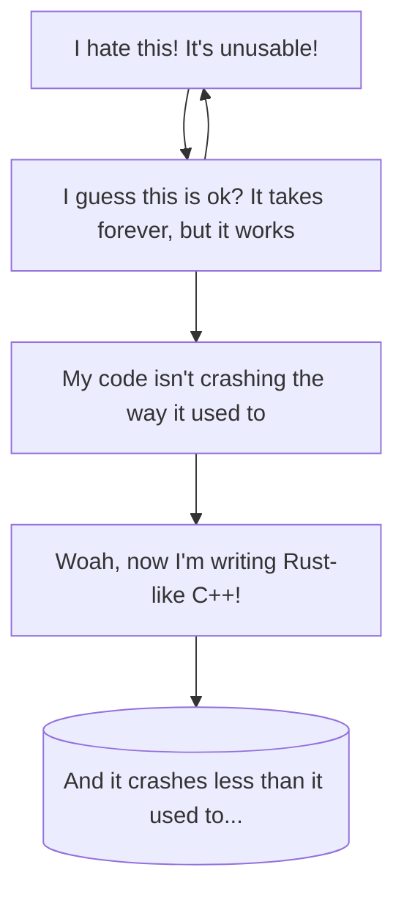

# The Dreaded Borrow Checker

Lots of people have said to me over the years: "I tried to like Rust, but the borrow checker killed it for me." It may be Stockholm syndrome, but after years of working with Rust---the borrow checker is my friend.

We've made it a day without a borrow-checker issue. Simple code that does one thing at a time rarely triggers it.

Pretty much everyone who comes from another language goes through this cycle:



# Understanding the Borrow Checker

> The borrow checker has become more forgiving over the years. Any valid--probably safe--code that triggers the borrow checker is considered a bug by the Rust core team. As a result, it's getting more and more lenient.

To understand the borrow checker, you need to internalize some rules:

* Rust assumes that all programs may be multi-threaded.
* Only one thing at a time may *ever* have mutable (write) access to a variable.
* Any number of things may have *read only* access to a variable---but only if nothing can currently write to it.

This is generally good advice:
* Keep it simple.
* Keep a really obvious data-path through which data may be modified.

It also implies:
* Don't use Rust as an object-oriented language. It isn't one. You won't have much trouble if you combine simple data types and retain a store associating types with types---like a relational database.
* You *will* have a miserable time if you implement a bunch of functionality-specific traits, mix and match them, and store them in a giant, C++ style common object store. You'll tie yourself in knots trying to match traits, extract the information from *that* trait, and working with lots of borrowed trait data.

---

This is a cornerstone of "fearless concurrency", and eliminates whole classes of bugs:

* You can't use a variable after it's gone (moved or destroyed).
* You can't accidentally invalidate an iterator (by changing what its iterating).
* You can't accidentally destroy a variable while you are still using it somewhere else.
* You can't make a data race condition, because synchronized access makes it impossible. *Unless you mark your code as unsafe and promise Rust that you know what you're doing*. We'll look at this one when we get to concurrency.

In other words, as painful as it sounds---the borrow checker is there to help you not create potentially disastrous bugs.

It helps to understand one of the key designs of Rust:

* Everything is immutable by default unless you tell Rust otherwise.
* Making a variable, and then making a *new* variable for the next stage is good practice---functional programming style.
* Assignments are *move* by default...

## Understanding Move

Other than some small primitive types (numbers, mostly) that implement the `Copy` trait, Rust *moves variables* by default. This has two implications:
* The variable no longer exists in its previous state.
* The recipient now *has ownership* of the variable.

**Why does this matter?**

Take the following C++ program: [https://replit.com/@HerbertWolverso/UseAfterMove#main.cpp](https://replit.com/@HerbertWolverso/UseAfterMove#main.cpp)

```c++
#include <iostream>
#include <string>

void do_something(std::string s) {
  std::cout << s << "\n";
}

int main() {
  std::string s("Hello World");  
  do_something(std::move(s));
  do_something(std::move(s));
}
```

The program compiles and runs just fine. No warnings. But this is strange: we *moved* `s` into the function, and didn't move it back. Why does `s` still work for the second function call? Nobody knows: it's undefined behavior.

Use after free is a form of this, and Rust eliminates it. It's [a really common vulnerability, causing MANY CVEs](https://sensepost.com/blog/2017/linux-heap-exploitation-intro-series-used-and-abused-use-after-free/). It usually manifests are your program chugging along---possibly with corrupt data, a crash---and in some cases can be actively exploited.

> We're live-coding again. The Github (that won't compile!) is [here](/src/borrow_move1/)

Let's make a really innocuous looking program:

```rust
fn do_something(s: String) {
    println!("{s}");
}

fn main() {
    let s = "Hello".to_string();
    do_something(s);
    do_something(s);
}
```

This won't compile. The error message is very descriptive:

```
   Compiling borrow_move1 v0.1.0 (C:\Users\Herbert\Documents\Ardan\Rust Foundations 4 Day\src\borrow_move1)
error[E0382]: use of moved value: `s`
 --> src\borrow_move1\src\main.rs:8:18
  |
6 |     let s = "Hello".to_string();
  |         - move occurs because `s` has type `String`, which does not implement the `Copy` trait
7 |     do_something(s);
  |                  - value moved here
8 |     do_something(s);
  |                  ^ value used here after move
  |
note: consider changing this parameter type in function `do_something` to borrow instead if owning the value isn't necessary
 --> src\borrow_move1\src\main.rs:1:20
  |
1 | fn do_something(s: String) {
  |    ------------    ^^^^^^ this parameter takes ownership of the value
  |    |
  |    in this function
help: consider cloning the value if the performance cost is acceptable
  |
7 |     do_something(s.clone());
  |                   ++++++++

For more information about this error, try `rustc --explain E0382`.
error: could not compile `borrow_move1` due to previous error
```

`String` is not a copyable type, so when you pass `s` into `do_something`---you are *moving* it. You're handing over ownership, and the original `s` no longer exists in the `main()` function scope.

You could do as the compiler suggests:

```rust
fn do_something(s: String) {
    println!("{s}");
}

fn main() {
    let s = "Hello".to_string();
    do_something(s.clone());
    do_something(s);
}
```

The program now compiles and runs---but it's working because it took a complete deep copy of `s`, making a whole new variable and moved the new variable into `do_something`---which obligingly destroyed it when it finished. That's really wasteful.

In this case, you are better off passing a *reference* and borrowing the parameter:

```rust
fn do_something(s: &String) {
    println!("{s}");
}

fn main() {
    let s = "Hello".to_string();
    do_something(&s);
    do_something(&s);
}
```

Now you have a single `String` created, and passed a pointer to the function each time. No more "use after move" error.

### Let's expand on that and see how ownership and destruction works.

> We're live-coding again. The Github (that won't compile!) is [here](/src/borrow_move2/)

Let's prove that a move occurs:

```rust
struct Data(usize);

impl Drop for Data {
    fn drop(&mut self) {
        println!("Data object {} is being destroyed", self.0);
    }
}

fn do_something(d: Data) {
    println!("Hello data #{}", d.0);
}

fn main() {
    let data = Data(1);
    do_something(data);
    std::thread::sleep(std::time::Duration::from_secs(5));
    println!("Program ending");
}
```

The program runs and you immediately see:
```
Hello data #1
Data object 1 is being destroyed
```

5 seconds later, you see:
```
Program ending
```

> This also illustrates the RAII concept, which is on the menu for a bit later today.

## You Can Keep Moving

> We're live-coding again. The Github (that won't compile!) is [here](/src/borrow_move3/)

When you return a non-copy type from a function, that's a *move* too. For example:

```rust
struct Data(usize);

impl Drop for Data {
    fn drop(&mut self) {
        println!("Data object {} is being destroyed", self.0);
    }
}

fn do_something(d: Data) -> Data {
    println!("Hello data #{}", d.0);
    d
}

fn main() {
    let data = Data(1);
    let data = do_something(data);
    do_something(data);
    std::thread::sleep(std::time::Duration::from_secs(5));
    println!("Program ending");
}
```

> We're live-coding again. The Github (that won't compile!) is [here](/src/borrow_move4/)

Now you can chain `do_something`, using the moved data as the return type. The "builder pattern" in Rust is very common, and uses this approach to function. Let's look at what happens if we try the "obvious" (because everyone says to use `&mut self` and `&self`) with member functions to create a builder:

```rust
#[derive(Default)]
struct MyBuilder {
    a: bool,
}

impl MyBuilder {
    fn with(&mut self, a: bool) -> Self {
        self.a = a;
        self
    }

    fn build() -> Self {
        Self::default().with(true)
    }
}

fn main() {
    let x = MyBuilder::build();
}

```

1. This won't compile. `with` wants to return a `MyBuilder` - but `self` is a mutable reference to itself.
2. Try to de-reference self (`*self`) - and it won't compile because `MyBuilder` isn't marked as copyable.
3. Groan and return `self.clone()`---and derive `Clone` on the type---and it will compile, but now its horribly inefficient because it's making a whole new copy of itself and returning that.
4. Try returning `&mut Self` as the return type---and you have the same problem, just elsewhere.
5. So you try this:

```rust
fn build() -> &mut Self {
    Self::default().with(true)
}
```

Now your compiler error isn't really helpful at all. It suggests that you need to introduce a "lifetime" (the next section!). Let's follow its advice:

```rust
fn build() -> &'static mut Self {
    Self::default().with(true)
}
```

And now the error message tells why this was a bad idea to begin with:
```
cannot return reference to temporary value
returns a reference to data owned by the current function
```

Rust makes it *really hard* to accidentally create a variable and return a pointer to it (if the pointer were returned, it would be invalid---because the function has cleaned up the memory to which the reference pointed. In C, you just created a CVE!)

> We're live-coding again. The Github (that won't compile!) is [here](/src/borrow_move5/)

Here's what you should do:

```rust
#[derive(Default)]
struct MyBuilder {
    a: bool,
}

impl MyBuilder {
    fn with(mut self, a: bool) -> Self {
        self.a = a;
        self
    }

    fn build() -> Self {
        Self::default().with(true)
    }
}

fn main() {
    let _x = MyBuilder::build();
}
```

The "builder" pattern is really common in Rust---it avoids borrow checker issues. You *move* out of each step, never borrowing. If you never borrow, the borrow checker won't even look at your code!

**Why don't I have this problem in Go/Java/C#/etc.?**

Many higher-level languages with a garbage collector built in prevent this from happening by abstracting variables. Your variable doesn't actually represent your variable itself: it's a pointer to a variable stored in memory. The variable is either reference counted---a number goes up when you access it, or tracked through a generational garbage collector that notices when a variable is no longer used and occasionally cleans things up.

By default, you are passing variables into functions *by reference*: you are creating a *pointer* to the variable, and passing that. You can do the same in Rust with a borrow:

```
fn do_something(s: &String)
```

Or for mutability:

```
fn do_something(s: &mut String)
```

The Rust approach is *much faster*, but carries a pitfall: you are now responsible for keeping track of this. Coming from languages that don't require you to keep tabs on who owns what can be intimidating. The golden rule still applies: keep it simple. If you are passing variables all over to be changed, that's frequently a code smell---a sign that your design has problems. The difference is that Rust will hit you with the problems up-front, other languages will do their best to shield you from them.

## Iterators and the Borrow Checker

When I started using Rust, I ran into all kinds of problems combining iterators with data updates.

Here's an example that will work in a lot of C-like languages:

```rust
struct Node {
    parent: usize,
}

fn main() {
    let mut nodes = vec![
        Node{parent: 0},
        Node{parent: 1},
        Node{parent: 2},
    ];

    nodes.iter().enumerate().for_each(|(i, node)| {
        if node.parent == 1 && i > 0 {
            nodes[i-1].parent = 0;
        }
    });
}
```

We've carefully guarded against accidentally trying to update `nodes[-1]`, and all we want to do is update the *previous* record if we run across `parent == 1`. That really should be safe and simple, right?

It fails to compile with the error message:

```
cannot borrow `nodes` as mutable because it is also borrowed as immutable
mutable borrow occurs here
```

That's not very helpful. What it *means* is that by creating an iterator with `.iter()`, you are *borrowing* the entire `nodes` vector. So changing an element in the vector while you iterate it is forbidden under the rules we talked about: **you can't have mutable access to anything while something else has any access to it**.

In this case, it's probably harmless to change the list while you iterate it---but it's practically impossible to *prove* that it's actually safe. Iterators are typically invalidated if any of the underlying data changes. You can even replace the iterator code with a simple loop and you're fine:

```rust
for i in 1..nodes.len() {
    if nodes[i].parent == 1 {
        nodes[i-1].parent = 0;
    }
}
```

There's no iterator to borrow anything, so once again you've solved the borrowing problem---by not borrowing.

Think of variables as being like your car. You may be happy to lend it out, but you want to keep close track of who uses it---and be sure that you will get it back (unless it was a gift and you want to *move ownership* of the car to your friend).
