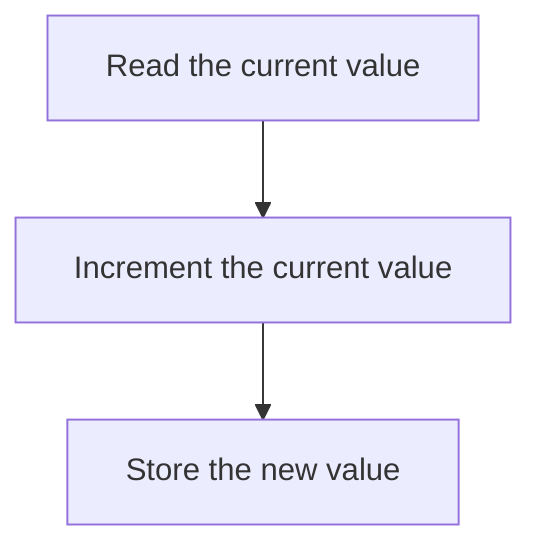

# Racing Data

A *data race* or *race condition* occurs whenever multiple objects can try to write to the same thing at once---and there's no form of synchronization in place to prevent it.

Here's a port of the inefficient prime number generator in C++:

```c++
#include <iostream>
#include <thread>

bool is_prime(uint32_t n) {
    for (uint32_t i = 2; i <= n / 2; ++i) {
        if (n % i == 0) return false;
    }
    return true;
}

int main() {
    const auto max = 200000;
    uint32_t count = 0;
    std::thread t1([&count, max]() {
        for (auto i = 2; i < max / 2; i++) {
            if (is_prime(i)) ++count;
        }
        });
    std::thread t2([&count, max]() {
        for (auto i = max / 2; i < max; i++) {
            if (is_prime(i)) ++count;
        }
        });
    t1.join();
    t2.join();
    std::cout << "Found " << count << " prime numbers.\n";
}
```

This is located in [/src/cpp](/src/cpp/) - let's open it up in Visual Studio.

Notice:
* "No issues found" - the program is valid.

Let's run this program a few times:

```
cd src\cpp\Primes\x64\Release
PS C:\Users\Herbert\Documents\Ardan\Rust Foundations 4 Day\src\cpp\Primes\x64\Release> .\Primes.exe
Found 17982 prime numbers.
PS C:\Users\Herbert\Documents\Ardan\Rust Foundations 4 Day\src\cpp\Primes\x64\Release> .\Primes.exe
Found 17983 prime numbers.
PS C:\Users\Herbert\Documents\Ardan\Rust Foundations 4 Day\src\cpp\Primes\x64\Release> .\Primes.exe
Found 17984 prime numbers.
PS C:\Users\Herbert\Documents\Ardan\Rust Foundations 4 Day\src\cpp\Primes\x64\Release> .\Primes.exe
Found 17984 prime numbers.
PS C:\Users\Herbert\Documents\Ardan\Rust Foundations 4 Day\src\cpp\Primes\x64\Release> .\Primes.exe
Found 17984 prime numbers.
```

That's not great---we're getting different results each time!

## The Same Problem in Go

Here's the same program in Go:

```go
package main

import "fmt"

var max = 10000
var count = 0

func is_prime(n int) bool {
	for i := 2; i < n; i++ {
		if n%i == 0 {
			return false
		}
	}
	return true
}

func first_half() {
	for i := 2; i < max/2; i++ {
		if is_prime(i) {
			count++
		}
	}
}

func second_half() {
	for i := max / 2; i < max; i++ {
		if is_prime(i) {
			count++
		}
	}
}

func main() {
	go first_half()
	second_half()
	fmt.Println(count)
}
```

> [Playground Link](https://goplay.tools/snippet/E3DjYEJlSP9)

Running it a few times (it's using a lower number of checks to keep the playground happy), we see:

```
1229
1228
1227
1229
```

## What's Happening Here?

This is happening because each thread is adding to `count` with no form of synchronization. Adding requires:



When you have multiple threads running, there's no way to know where in the process another thread has got to: it might be fetching, incrementing or storing. Running the same task concurrently can overwrite the work of a previous thread. Worse: **it can create bad data silently, without warning you**.

Let's try and write the same thing in Rust.

> Live-coding, the Github version is [here](/src/count_primes_bad/)

```rust
fn is_prime(n: u32) -> bool {
    (2 ..= n/2).all(|i| n % i != 0 )
 }

fn main() {
    const MAX: u32 = 200_000;
    let mut counter = 0;
    let t1 = std::thread::spawn(|| {
       counter += (2 .. MAX/2).filter(|n| is_prime(*n)).count();
    });
    let t2 = std::thread::spawn(|| {
       counter += (MAX/2 .. MAX).filter(|n| is_prime(*n)).count();
    });
    t1.join();
    t2.join();
    println!("Found {counter} prime numbers in the range 2..{MAX}");
 }
```

The Rust version won't compile at all. It's quite the error message:

```
error[E0373]: closure may outlive the current function, but it borrows `counter`, which is owned by the current function
  --> src\count_primes_bad\src\main.rs:8:33
   |
8  |     let t1 = std::thread::spawn(|| {
   |                                 ^^ may outlive borrowed value `counter`
9  |        counter += (2 .. MAX/2).filter(|n| is_prime(*n)).count();
   |        ------- `counter` is borrowed here
   |
note: function requires argument type to outlive `'static`
  --> src\count_primes_bad\src\main.rs:8:14
   |
8  |       let t1 = std::thread::spawn(|| {
   |  ______________^
9  | |        counter += (2 .. MAX/2).filter(|n| is_prime(*n)).count();
10 | |     });
   | |______^
help: to force the closure to take ownership of `counter` (and any other referenced variables), use the `move` keyword
   |
8  |     let t1 = std::thread::spawn(move || {
   |                                 ++++

error[E0499]: cannot borrow `counter` as mutable more than once at a time
  --> src\count_primes_bad\src\main.rs:11:33
   |
8  |       let t1 = std::thread::spawn(|| {
   |                -                  -- first mutable borrow occurs here
   |  ______________|
   | |
9  | |        counter += (2 .. MAX/2).filter(|n| is_prime(*n)).count();
   | |        ------- first borrow occurs due to use of `counter` in closure
10 | |     });
   | |______- argument requires that `counter` is borrowed for `'static`
11 |       let t2 = std::thread::spawn(|| {
   |                                   ^^ second mutable borrow occurs here
12 |          counter += (MAX/2 .. MAX).filter(|n| is_prime(*n)).count();
   |          ------- second borrow occurs due to use of `counter` in closure

error[E0373]: closure may outlive the current function, but it borrows `counter`, which is owned by the current function
  --> src\count_primes_bad\src\main.rs:11:33
   |
11 |     let t2 = std::thread::spawn(|| {
   |                                 ^^ may outlive borrowed value `counter`
12 |        counter += (MAX/2 .. MAX).filter(|n| is_prime(*n)).count();
   |        ------- `counter` is borrowed here
   |
note: function requires argument type to outlive `'static`
  --> src\count_primes_bad\src\main.rs:11:14
   |
11 |       let t2 = std::thread::spawn(|| {
   |  ______________^
12 | |        counter += (MAX/2 .. MAX).filter(|n| is_prime(*n)).count();
13 | |     });
   | |______^
help: to force the closure to take ownership of `counter` (and any other referenced variables), use the `move` keyword
   |
11 |     let t2 = std::thread::spawn(move || {
   |                                 ++++

error[E0502]: cannot borrow `counter` as immutable because it is also borrowed as mutable
  --> src\count_primes_bad\src\main.rs:16:22
   |
8  |       let t1 = std::thread::spawn(|| {
   |                -                  -- mutable borrow occurs here
   |  ______________|
   | |
9  | |        counter += (2 .. MAX/2).filter(|n| is_prime(*n)).count();
   | |        ------- first borrow occurs due to use of `counter` in closure
10 | |     });
   | |______- argument requires that `counter` is borrowed for `'static`
...
16 |       println!("Found {counter} prime numbers in the range 2..{MAX}");
   |                        ^^^^^^^ immutable borrow occurs here
   |
   = note: this error originates in the macro `$crate::format_args_nl` which comes from the expansion of the macro `println` (in Nightly builds, run with -Z macro-backtrace for more info)

Some errors have detailed explanations: E0373, E0499, E0502.
For more information about an error, try `rustc --explain E0373`.
error: could not compile `count_primes_bad` due to 4 previous errors
```

But the error message boils down to: **Rust detected your race condition, and won't let you corrupt your data.**

Of the three languages, only Rust saves the day.